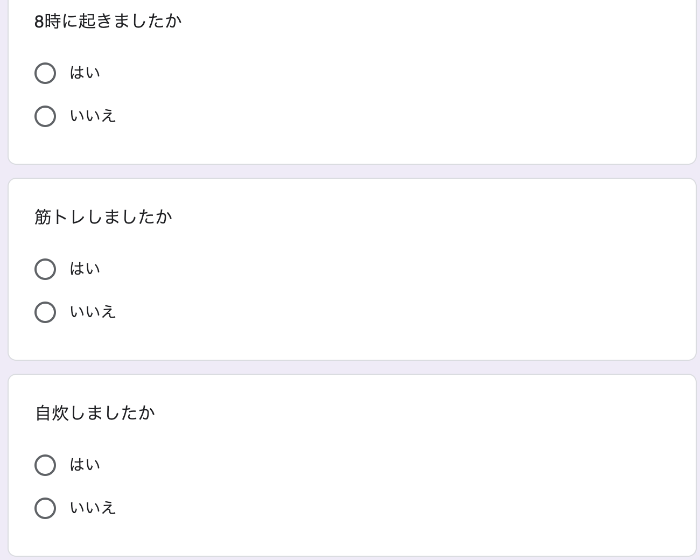

# What is it ?
Notion に日々の習慣をチェックするためのデータベースを作ったのですが、毎日ログインしてチェックボックスにチェック入れて、とするのは面倒です。 

そこで、いかに楽に日々の習慣をチェックするか求めた結果こうなりました。 

1. 毎日 23 時に Slack に Google Forms が来る
2. その日を振り返って、質問に答える
3. Google Forms の回答を集計し、Notion のデータベースに追加する

Google Forms に回答

 
Notion Database に格納

今回の実装では、k8s を勉強し始めたこともあり、Workloads API を使用してのアウトプットも兼ねています。

# Architecture

# Apps
このシステムは、3つのアプリケーションから成り立っています。 

- notifier
  - Slack API を用いて、毎日 23 時に Google Forms の URL を送る
  - Golang
- aggregator
  - Google Forms API とサービスアカウントを用いて、Google Forms の結果を集計し、registerer に gRPC 経由で通信
  - Golang
- registerer
  - aggregator からの情報を、Notion Database に追記
  - ドキュメント、JSON の複雑さから Node.js

# Next Actions
- 集計結果を毎回全部更新しているので、DB に保存して差分をみる
  - k8s の Database 系の API を学ぶ
- CI/CD
  - Github Actions を学ぶ
- テスト書く
  - 言わずもがな
- Node.js の Docker image を小さくする
- サービスアカウントをしっかり設定する